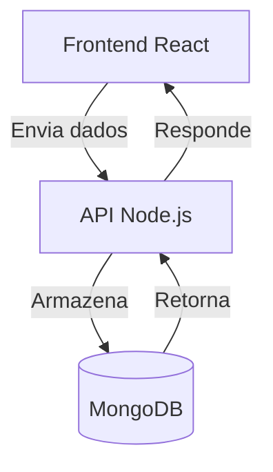

# 📌 API - Registro de Usuários

API REST desenvolvida com **Node.js**, **Express** e **Prisma** para integração com **MongoDB**.  
Faz parte do projeto full-stack de cadastro e listagem de usuários.

---

## 🛠 Tecnologias Utilizadas

## 🔄 Fluxo da Aplicação

## ⚙️ Funcionalidades

- Criar usuários
- Listar usuários
- Filtrar usuários por **nome**, **email** ou **idade**
- Atualizar usuários
- Deletar usuários

  
 
